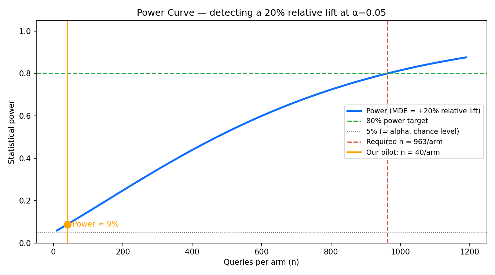
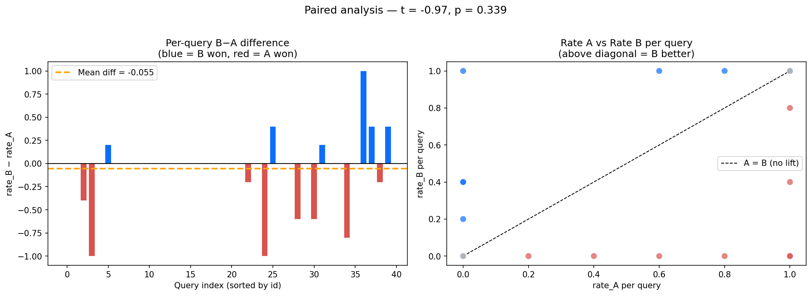
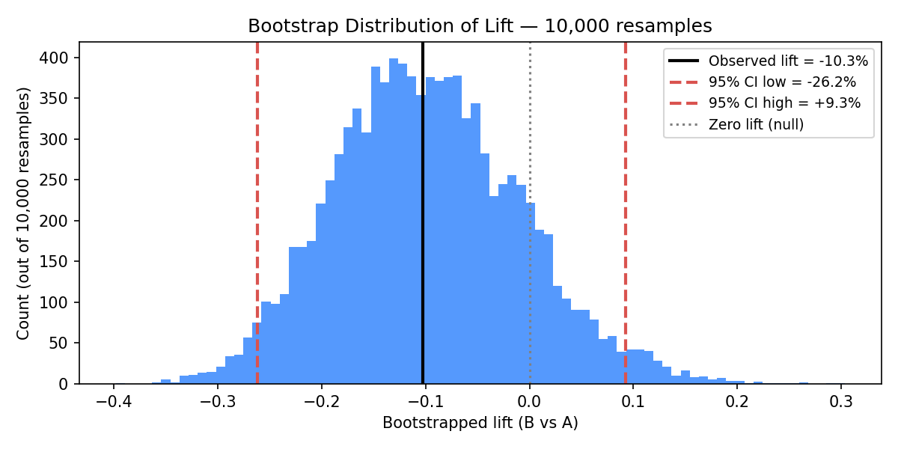

# LLM Eval & Experimentation Harness

> A lightweight platform to evaluate LLM features: define a metric, run A/B variants of a task, score outputs with an LLM-as-judge, get statistical significance + power analysis, and view results in a dashboard.
>
> **Demoed on AEO** — does AEO-optimized content get recommended more by an AI answer engine?

---

## What this is

Most LLM feature work lives in one-off notebooks. This project builds the **kitchen instead of the meal**, essentially a reusable harness where you plug in a task, run A/B variants, and get statistically rigorous results.

The three platform capabilities it demonstrates:

| Capability | What it means |
|---|---|
| **Experimentation platform** | Clean A/B test infrastructure anyone can run, not a one-off analysis |
| **AI eval framework** | LLM-as-judge scoring with two-layer statistical testing (z-test + paired t-test) |
| **LLM analytics** | Per-query breakdown, power analysis, bootstrap CI on lift |

The abstractions are generic and pluggable — tasks, evaluators, and metrics are interfaces. AEO is one implementation. Summarization or code-gen could drop in without touching the platform core.

---

## The demo: Answer Engine Optimization (AEO)

**The question:** If you rewrite your content in an "answer-engine-friendly" format (FAQ structure, answer-first sentences, concrete stats, chunk-friendly headers), does an LLM answer engine recommend your product more often?

**The wind-tunnel design:** We can't A/B test ChatGPT's/Gemini's real ranker — we don't own it. So we built a RAG answer engine we *do* own and tested content variants inside it.

```
Corpus A (control)   = [variant_a.md — marketing style] + [5 fixed competitor docs]
Corpus B (treatment) = [variant_b.md — AEO-optimized]  + [same 5 competitor docs]
```

Only the treatment doc differs between corpora. Any change in recommendation rate is attributable to the content optimization, not the retrieval environment.

**Domain:** SaaS project management tools. Our product: **TaskFlow Pro** (fictional).  
**Outcome metric (binary):** Was TaskFlow Pro explicitly recommended in the generated answer?

---

## Architecture

```
core/
├── interfaces.py      # Task, Variant, Evaluator, Metric — abstract platform spine
├── runner.py          # ExperimentRunner: loops queries × variants × repeats → results.csv
├── stats.py           # two-proportion z-test, paired t-test, bootstrap CI, power analysis
└── store.py           # append/read results.csv

tasks/aeo/
├── generate_content.py   # LLM: product brief → variant_a.md + variant_b.md
├── generate_queries.py   # LLM: 40 synthetic PM-tool queries
├── corpus.py             # chunk + embed + in-memory cosine index (per arm)
├── answer_engine.py      # RAG Task: retrieve top-k chunks → LLM answer
└── judge.py              # AEO Evaluator: LLM-as-judge → {recommended, position, accepted}

dashboard/app.py       # Streamlit: rates, lift + CI, per-query charts, raw trial table
```

**Key design choices:**
- **Embeddings:** `all-MiniLM-L6-v2` (local, free, no API key, 384-dim)
- **LLM:** `claude-haiku-4-5-20251001` for answers and judging (fast, cheap)
- **Vector store:** in-memory numpy cosine similarity (no infra dependencies)
- **Stats:** `statsmodels` + `scipy`

---

## Results

> **Pre-registered design:** 40 queries × 2 arms × 5 repeats = 400 trials. Primary metric: recommendation rate. Primary test: paired t-test on per-query rates. Pre-registered MDE: +20% relative lift. Power requirement: 80% at α = 0.05.

| Metric | Value |
|---|---|
| Arm A — control (marketing style) | **53.5%** recommendation rate (107 / 200 trials) |
| Arm B — treatment (AEO-optimized) | **48.0%** recommendation rate (96 / 200 trials) |
| Raw lift | **−10.3%** |
| Bootstrap 95% CI on lift | **[−26.5%, +8.5%]** |
| Two-proportion z-test p-value | 0.271 |
| Paired t-test p-value *(lead result)* | **0.339** |
| Query-level wins (B > A) | 6 of 40 queries |

**Verdict:** Not statistically significant (p = 0.34 > 0.05). The 95% CI straddles zero, so we cannot rule out chance in either direction.

### Why this result is still informative

The pilot was designed to demonstrate methodology, not produce a publishable conclusion. At 40 queries/arm the test has ~8% power to detect a 20% relative lift — meaning it would miss a real effect 92% of the time. The required sample size for 80% power is **963 queries/arm**.



### Per-query breakdown

The paired analysis shows 8 queries where A outperformed B, 6 where B outperformed A, and 26 ties. The most extreme case (q04): arm A 100% vs arm B 0% across all 5 repeats — a complete flip driven by which chunks were retrieved.



### Bootstrap distribution of lift

The wide distribution confirms that 200 trials per arm are not enough to pin down the lift precisely. The true lift could plausibly be anywhere in a ±25% range.



---

## Experimental rigor

**Trial unit:** `(query, arm, repeat)`. Repeats at temperature 0.7 handle LLM stochasticity.

**Arm interleaving:** For each `(query, repeat)` pair, arm A and arm B are run back-to-back — not all A then all B. This prevents time-based confounds (rate limits, model drift) from biasing one arm.

**Two stat layers:**
1. *Two-proportion z-test* (headline, naive): treats all trials as IID. Fast to interpret but inflated by within-query correlation.
2. *Paired t-test* (rigorous, lead result): aggregates 5 repeats → per-query rate, then tests whether the mean B−A difference is non-zero. Eliminates between-query variance.

**LLM-as-judge:** Strict JSON rubric, temperature 0 (deterministic labels), validated on 4 hand-labeled cases before deployment (all passed).

**Resumability:** The runner checkpoints every trial to `results.csv`. Re-running picks up exactly where it left off and no duplicate rows, no wasted API calls.

---

## Honest caveats

| What is real | What is synthetic |
|---|---|
| LLM calls (answer + judge) | Queries — generated, not from real users |
| Retrieval via embeddings + cosine similarity | Corpus — fictional company docs |
| Two-layer statistical testing | `accepted` field — proxy for user acceptance, not real behaviour |
| Power analysis with pre-registered MDE | Answer engine — our RAG, not ChatGPT/Gemini |

**This is a methodology demonstration, not a claim of real-world lift.**

The "accepted" signal is defined as `recommended AND position == 1` is a simulation of a user accepting the top recommendation. It does not reflect real user behavior and is flagged as synthetic throughout.

---

## Quickstart

```bash
# 1. Install dependencies
pip install -r requirements.txt

# 2. Set your Anthropic API key
cp .env.example .env
# edit .env: ANTHROPIC_API_KEY=sk-ant-...

# 3. Generate content + queries (if not already cached)
python -m tasks.aeo.generate_content
python -m tasks.aeo.generate_queries

# 4. Run the experiment (~30 min, ~800 LLM calls, resumable)
python -m core.runner

# 5. View the dashboard
streamlit run dashboard/app.py
```

All knobs (model, n_queries, n_repeats, temperature, top_k, MDE) live in `config.yaml`.

---

## Extending the platform

The platform spine (`core/interfaces.py`) defines four abstract classes: `Task`, `Variant`, `Evaluator`, `Metric`. To plug in a new experiment (e.g. summarization quality, code generation correctness):

1. Implement `Task.run(query, variant) -> dict`
2. Implement `Evaluator.evaluate(query, output, variant) -> dict`
3. Point `runner.py` at your new task + evaluator
4. The stats, store, and dashboard require no changes

---

## Repo structure

```
.
├── config.yaml                  # all experiment knobs
├── core/                        # generic platform (no AEO-specific code)
├── tasks/aeo/                   # AEO implementation of the interfaces
├── dashboard/app.py             # Streamlit results dashboard
├── data/
│   ├── content/                 # variant_a.md, variant_b.md, distractors/
│   ├── queries.json             # 40 synthetic PM-tool queries
│   └── results/                 # results.csv + figures
├── docs/
│   ├── DECISIONS.md             # architectural decision records
│   └── LEARNING_LOG.md          # dated concept diary
├── notebooks/analysis.ipynb     # RAG pipeline walkthrough + stat analysis
└── tests/test_stats.py          # unit tests for stats math
```
